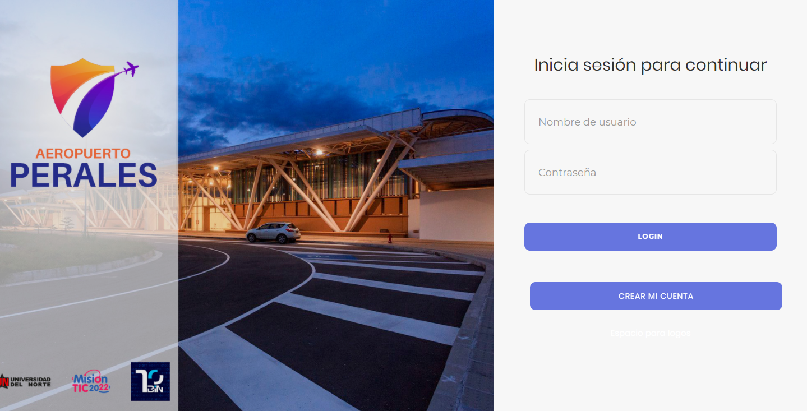
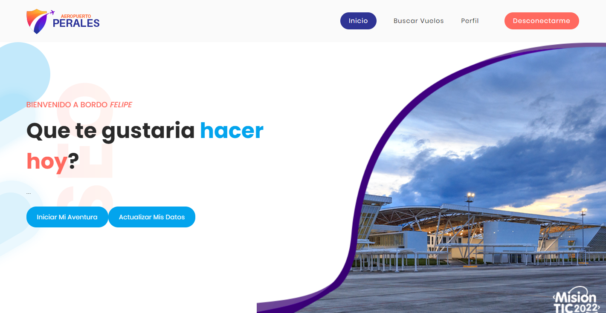

# Gestor de Vuelos

Nuestra app es un gestor de vuelos diseñado para que el usuario final pueda realizar reservas en estos

El proyecto se realizó como trabajo final para el ciclo 3 de Mision Tic en la Universidad del Norte

## Lenguajes, frameworks y librerías

El backend esta diseñado en Python/Flask, para el front-end tenemos Html, CSS y JavaScript.

Para su funcionamiento proyecto requiere las siguientes librerias:

- cachelib==0.4.1
- cachetools==4.2.4
- certifi==2021.5.30
- charset-normalizer==2.0.6
- click==8.0.1
- coverage==6.0.2
- cssselect==1.1.0
- cssutils==2.3.0
- Flask==2.0.1
- Flask-Session==0.4.0
- Flask-WTF==0.15.1
- gunicorn==20.1.0
- idna==3.2
- itsdangerous==2.0.1
- Jinja2==3.0.1
- jsonify==0.5
- lxml==4.6.3
- MarkupSafe==2.0.1
- premailer==3.10.0
- python-decouple==3.5
- requests==2.26.0
- urllib3==1.26.7
- validate-email==1.3
- Werkzeug==2.0.1
- WTForms==2.3.3
- yagmail==0.14.260
## Instalación

Primero debemos crear un entorno virtual en python 

```bash
  python3 -m venv venv
```

Luego lo activamos

```bash
  source venv/bin/activate
```

Procedemos a exportar las variables de entorno que requiere Flask

```bash
  export FLASK_APP=app.py
  export FLASK_ENV=development
  export FLASK_DEBUG=1
```
Finalmente lanzamos el servidor de Flask

```bash
  flask run
```

¡Y ya esta!

## Autores

- Danilo Belluccio
- Juan Castellar
- Julian Estrada
- Leonard Rodriguez
- Carlos Sanabria


## Screenshots




